# Spreadsheet API

Read, update and manage CSV files with formula support Common use cases: - Load a CSV file and interact with it like a spreadsheet - Read specific cells, rows, or columns - Update cells (supports formulas starting with =) - Compute values based on formulas

> **6 tools** · API Photon · v1.0.0 · MIT

**Platform Features:** `custom-ui`

## ⚙️ Configuration

No configuration required.


## 📋 Quick Reference

| Method | Description |
|--------|-------------|
| `main` | Main entry point - returns the UI for the spreadsheet |
| `load` | Load a CSV file into the spreadsheet engine |
| `get` | Get the evaluated value of a specific cell |
| `getFormula` | Get the raw formula of a specific cell |
| `set` | Update a cell with a value or formula |
| `view` | Get an evaluated view of the entire spreadsheet or a range |


## 🔧 Tools


### `main`

Main entry point - returns the UI for the spreadsheet


---


### `load`

Load a CSV file into the spreadsheet engine


| Parameter | Type | Required | Description |
|-----------|------|----------|-------------|
| `file` | any | Yes | Path to the CSV file to load |


---


### `get`

Get the evaluated value of a specific cell


| Parameter | Type | Required | Description |
|-----------|------|----------|-------------|
| `cell` | any | Yes | Cell reference (e.g. `A1`) |


---


### `getFormula`

Get the raw formula of a specific cell


| Parameter | Type | Required | Description |
|-----------|------|----------|-------------|
| `cell` | any | Yes | Cell reference (e.g. `A1`) |


---


### `set`

Update a cell with a value or formula


| Parameter | Type | Required | Description |
|-----------|------|----------|-------------|
| `cell` | any | Yes | Cell reference (e.g. `A1`) |
| `value` | string } | Yes | Value or formula (starts with =) to insert |


---


### `view`

Get an evaluated view of the entire spreadsheet or a range


| Parameter | Type | Required | Description |
|-----------|------|----------|-------------|
| `range` | any | Yes | Optional range like A1:D10. If omitted, returns all data. |


---


## 🏗️ Architecture

```mermaid
flowchart LR
    subgraph spreadsheet["📦 Spreadsheet"]
        direction TB
        PHOTON((🎯))
        T0[🔧 main]
        PHOTON --> T0
        T1[📖 load]
        PHOTON --> T1
        T2[📖 get]
        PHOTON --> T2
        T3[📖 getFormula]
        PHOTON --> T3
        T4[✏️ set]
        PHOTON --> T4
        T5[🔧 view]
        PHOTON --> T5
    end

    subgraph deps["Dependencies"]
        direction TB
        NPM0[📚 csv-parse]
        NPM1[📚 csv-stringify]
    end
```




## 📥 Usage

```bash
# Install from marketplace
photon add spreadsheet

# Get MCP config for your client
photon info spreadsheet --mcp
```

## 📦 Dependencies


```
csv-parse, csv-stringify
```

---

MIT · v1.0.0 · Arul
