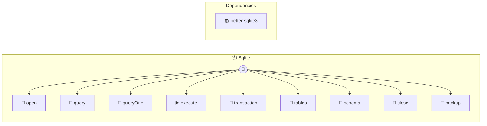

# SQLite

File or in-memory SQL database

> **9 tools** · API Photon · v1.1.0 · MIT


## ⚙️ Configuration


| Variable | Required | Type | Description |
|----------|----------|------|-------------|
| `S_Q_LITE_PATH` | No | string | No description available (default: `:memory:`) |


## 🔧 Tools


### `open`

Open a SQLite database


| Parameter | Type | Required | Description |
|-----------|------|----------|-------------|
| `path` | string | Yes | Database file path  or ":memory:" for in-memory (e.g. `data.db`) |
| `readonly` | boolean | No | Open in read-only mode |


---


### `query`

Execute a SELECT query


| Parameter | Type | Required | Description |
|-----------|------|----------|-------------|
| `sql` | string | Yes | SQL query [field: textarea] (e.g. `SELECT * FROM users WHERE id = ?`) |
| `params` | any[] | No | Query parameters for prepared statements |


---


### `queryOne`

Execute a SELECT and return first row


| Parameter | Type | Required | Description |
|-----------|------|----------|-------------|
| `sql` | string | Yes | SQL query [field: textarea] (e.g. `SELECT * FROM users WHERE id = ?`) |
| `params` | any[] | No | Query parameters |


---


### `execute`

Execute an INSERT, UPDATE, or DELETE


| Parameter | Type | Required | Description |
|-----------|------|----------|-------------|
| `sql` | string | Yes | SQL statement [field: textarea] (e.g. `INSERT INTO users (name) VALUES (?)`) |
| `params` | any[] | No | Statement parameters |


---


### `transaction`

Execute multiple statements in a transaction


| Parameter | Type | Required | Description |
|-----------|------|----------|-------------|
| `statements` | Array<{ sql: string | Yes | Array of SQL statements with optional parameters |


---


### `tables`

List all tables in database


---


### `schema`

Get schema for a table


| Parameter | Type | Required | Description |
|-----------|------|----------|-------------|
| `table` | string | Yes | Table name (e.g. `users`) |


---


### `close`

Close database connection


---


### `backup`

Create a backup of the database


| Parameter | Type | Required | Description |
|-----------|------|----------|-------------|
| `destination` | string | Yes | Backup file path (e.g. `backup.db`) |


---


## 🏗️ Architecture




## 📥 Usage

```bash
# Install from marketplace
photon add sqlite

# Get MCP config for your client
photon info sqlite --mcp
```

## 📦 Dependencies


```
better-sqlite3@^11.0.0
```

---

MIT · v1.1.0 · Portel
