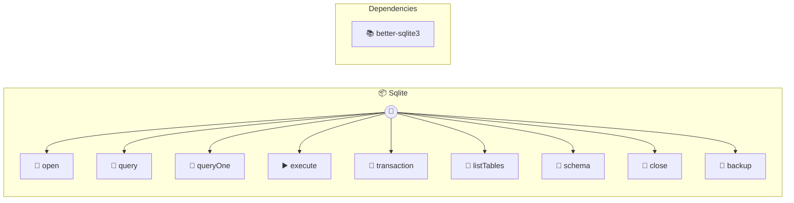

# SQLite Photon MCP

SQLite database operations

> **9 tools** · API Photon · v1.1.0 · MIT


## ⚙️ Configuration


| Variable | Required | Type | Description |
|----------|----------|------|-------------|
| `S_Q_LITE_PATH` | No | string | No description available |


## 🔧 Tools


### `open`

Open a SQLite database


| Parameter | Type | Required | Description |
|-----------|------|----------|-------------|
| `path` | string | Yes | Database file path (use ":memory:" for in-memory database) |
| `readonly` | boolean | No | Open in readonly mode |


---


### `query`

Execute a SELECT query


| Parameter | Type | Required | Description |
|-----------|------|----------|-------------|
| `sql` | string | Yes | SQL query string |
| `params` | any[] | No | Query parameters (for prepared statements) |


---


### `queryOne`

Execute a single SELECT query and return first row


| Parameter | Type | Required | Description |
|-----------|------|----------|-------------|
| `sql` | string | Yes | SQL query string |
| `params` | any[] | No | Query parameters (for prepared statements) |


---


### `execute`

Execute an INSERT, UPDATE, or DELETE statement


| Parameter | Type | Required | Description |
|-----------|------|----------|-------------|
| `sql` | string | Yes | SQL statement string |
| `params` | any[] | No | Statement parameters (for prepared statements) |


---


### `transaction`

Execute multiple SQL statements in a transaction


| Parameter | Type | Required | Description |
|-----------|------|----------|-------------|
| `statements` | Array<{ sql: string | Yes | Array of SQL statements with optional parameters |


---


### `listTables`

List all tables in the database


---


### `schema`

Get schema information for a table


| Parameter | Type | Required | Description |
|-----------|------|----------|-------------|
| `table` | string | Yes | Table name |


---


### `close`

Close the database connection


---


### `backup`

Create a backup of the database


| Parameter | Type | Required | Description |
|-----------|------|----------|-------------|
| `destination` | string | Yes | Path to backup file |


---


## 🏗️ Architecture




## 📥 Usage

```bash
# Install from marketplace
photon add sqlite

# Get MCP config for your client
photon info sqlite --mcp
```

## 📦 Dependencies


```
better-sqlite3@^11.0.0
```

---

MIT · v1.1.0 · Portel
