# SQLite Photon MCP

SQLite database operations

> **15 tools** · API Photon · v1.1.0 · MIT


## ⚙️ Configuration


| Variable | Required | Type | Description |
|----------|----------|------|-------------|
| `S_Q_LITE_PATH` | No | string | No description available |


## 🔧 Tools


### `open`

Open a SQLite database


| Parameter | Type | Required | Description |
|-----------|------|----------|-------------|
| `path` | any | Yes | Database file path (use ":memory:" for in-memory database) |
| `readonly` | any | No | Open in readonly mode |


---


### `query`

Execute a SELECT query


| Parameter | Type | Required | Description |
|-----------|------|----------|-------------|
| `sql` | any | Yes | SQL query string |
| `params` | any | Yes | Query parameters (for prepared statements) |


---


### `queryOne`

Execute a single SELECT query and return first row


| Parameter | Type | Required | Description |
|-----------|------|----------|-------------|
| `sql` | any | Yes | SQL query string |
| `params` | any | Yes | Query parameters (for prepared statements) |


---


### `execute`

Execute an INSERT, UPDATE, or DELETE statement


| Parameter | Type | Required | Description |
|-----------|------|----------|-------------|
| `sql` | any | Yes | SQL statement string |
| `params` | any | Yes | Statement parameters (for prepared statements) |


---


### `transaction`

Execute multiple SQL statements in a transaction


| Parameter | Type | Required | Description |
|-----------|------|----------|-------------|
| `statements` | any | Yes | Array of SQL statements with optional parameters |


---


### `listTables`

List all tables in the database


---


### `schema`

Get schema information for a table


| Parameter | Type | Required | Description |
|-----------|------|----------|-------------|
| `table` | any | Yes | Table name |


---


### `close`

Close the database connection


---


### `backup`

Create a backup of the database


| Parameter | Type | Required | Description |
|-----------|------|----------|-------------|
| `destination` | any | Yes | Path to backup file |


---


### `testBeforeAll`

No description available


---


### `testAfterAll`

No description available


---


### `testOpen`

No description available


---


### `testTables`

No description available


---


### `testInsertQuery`

No description available


---


### `testSchema`

No description available


---


## 🏗️ Architecture

```mermaid
flowchart LR
    subgraph sqlite["📦 Sqlite"]
        direction TB
        PHOTON((🎯))
        T0[🔧 open]
        PHOTON --> T0
        T1[📖 query]
        PHOTON --> T1
        T2[📖 queryOne]
        PHOTON --> T2
        T3[▶️ execute]
        PHOTON --> T3
        T4[🔧 transaction]
        PHOTON --> T4
        T5[📖 listTables]
        PHOTON --> T5
        T6[🔧 schema]
        PHOTON --> T6
        T7[🔧 close]
        PHOTON --> T7
        T8[🔧 backup]
        PHOTON --> T8
        T9[✅ testBeforeAll]
        PHOTON --> T9
        T10[✅ testAfterAll]
        PHOTON --> T10
        T11[✅ testOpen]
        PHOTON --> T11
        T12[✅ testTables]
        PHOTON --> T12
        T13[✅ testInsertQuery]
        PHOTON --> T13
        T14[✅ testSchema]
        PHOTON --> T14
    end

    subgraph deps["Dependencies"]
        direction TB
        NPM0[📚 better-sqlite3]
    end
```




## 📥 Usage

```bash
# Install from marketplace
photon add sqlite

# Get MCP config for your client
photon get sqlite --mcp
```

## 📦 Dependencies


```
better-sqlite3@^11.0.0
```

---

MIT · v1.1.0 · Portel
