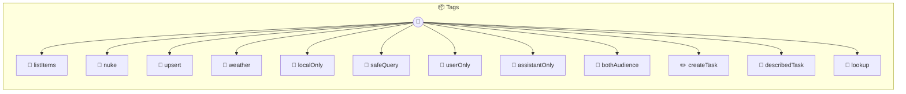

# Tags

Test fixture: MCP Spec Tags Exercises ALL MCP standard annotations, content annotations, structured output, and icon image features. Used by tests/mcp-spec-tags.test.ts in the photon runtime.

> **12 tools** · API Photon · v1.12.0 · MIT


## ⚙️ Configuration

No configuration required.


## 📋 Quick Reference

| Method | Description |
|--------|-------------|
| `listItems` | A read-only query that has no side effects |
| `nuke` | Permanently removes data — requires confirmation |
| `upsert` | Safe to retry — calling twice has same effect |
| `weather` | Calls an external API |
| `localOnly` | Operates only on local data |
| `safeQuery` | Combines multiple annotations |
| `userOnly` | Results shown only to the human user |
| `assistantOnly` | Results only for the AI assistant |
| `bothAudience` | Results for both user and assistant |
| `createTask` | Structured output — auto-inferred from TypeScript return type, zero tags |
| `describedTask` | Structured output — descriptions come from interface JSDoc, not tags |
| `lookup` | Method-level |


## 🔧 Tools


### `listItems`

A read-only query that has no side effects


---


### `nuke`

Permanently removes data — requires confirmation


---


### `upsert`

Safe to retry — calling twice has same effect


---


### `weather`

Calls an external API


---


### `localOnly`

Operates only on local data


---


### `safeQuery`

Combines multiple annotations


---


### `userOnly`

Results shown only to the human user


---


### `assistantOnly`

Results only for the AI assistant


---


### `bothAudience`

Results for both user and assistant


---


### `createTask`

Structured output — auto-inferred from TypeScript return type, zero tags


---


### `describedTask`

Structured output — descriptions come from interface JSDoc, not tags


---


### `lookup`

Method-level


| Parameter | Type | Required | Description |
|-----------|------|----------|-------------|
| `id` | string | Yes | User ID {@readOnly} |
| `name` | string | Yes | Display name |


---


## 🏗️ Architecture




## 📥 Usage

```bash
# Install from marketplace
photon add tags

# Get MCP config for your client
photon info tags --mcp
```

## 📦 Dependencies

No external dependencies.

---

MIT · v1.12.0
