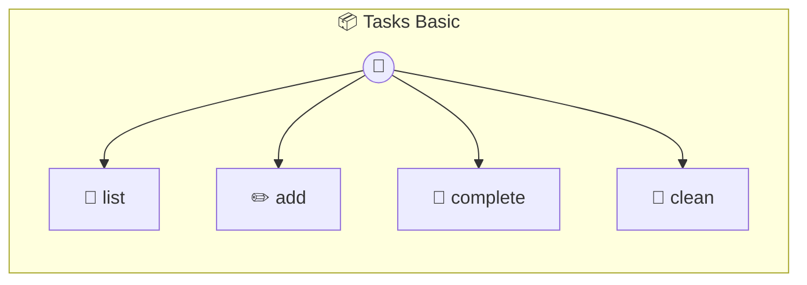

# Tasks Basic

Basic Task List — stateless, in-memory A simple todo list that works during a session but loses state on restart. Compare with tasks-live to see what @stateful adds.

> **4 tools** · API Photon · v1.8.4 · MIT

**Platform Features:** `stateful`

## ⚙️ Configuration

No configuration required.


## 🔧 Tools


### `list`

No description available


---


### `add`

No description available


---


### `complete`

No description available


---


### `clean`

No description available


---


## 🏗️ Architecture




## 📥 Usage

```bash
# Install from marketplace
photon add tasks-basic

# Get MCP config for your client
photon info tasks-basic --mcp
```

## 📦 Dependencies

No external dependencies.

---

MIT · v1.8.4
