# Tasks Basic

Tasks Basic — Stateless task list A simple todo list that works during a session but loses state on restart. Compare with tasks-live to see what persistence adds.

> **4 tools** · API Photon · v1.0.0 · MIT


## ⚙️ Configuration

No configuration required.


## 🔧 Tools


### `list`

List all tasks


---


### `add`

Add a new task


| Parameter | Type | Required | Description |
|-----------|------|----------|-------------|
| `text` | string | Yes | Task description |


---


### `complete`

Complete a task by index (1-based)


| Parameter | Type | Required | Description |
|-----------|------|----------|-------------|
| `index` | number | Yes | Task number (1-based) |


---


### `clean`

Remove completed tasks


---


## 🏗️ Architecture

```mermaid
flowchart LR
    subgraph tasks_basic["📦 Tasks Basic"]
        direction TB
        PHOTON((🎯))
        T0[📖 list]
        PHOTON --> T0
        T1[✏️ add]
        PHOTON --> T1
        T2[🔧 complete]
        PHOTON --> T2
        T3[🔧 clean]
        PHOTON --> T3
    end
```




## 📥 Usage

```bash
# Install from marketplace
photon add tasks-basic

# Get MCP config for your client
photon info tasks-basic --mcp
```

## 📦 Dependencies

No external dependencies.

---

MIT · v1.0.0 · Portel
