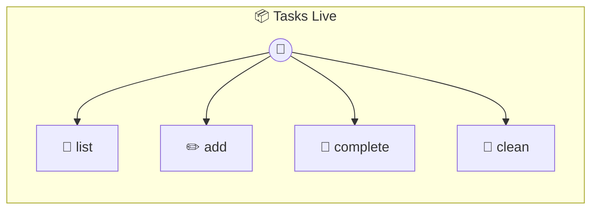

# Tasks Live

Tasks Live — Persistent reactive task list Same as tasks-basic but tasks survive restarts and UI updates in real-time. Uses `this.memory` for zero-boilerplate persistence.

> **4 tools** · API Photon · v1.0.0 · MIT

**Platform Features:** `stateful`

## ⚙️ Configuration

No configuration required.


## 🔧 Tools


### `list`

List all tasks


---


### `add`

Add a new task


| Parameter | Type | Required | Description |
|-----------|------|----------|-------------|
| `text` | string | Yes | Task description |


---


### `complete`

Complete a task by index (1-based)


| Parameter | Type | Required | Description |
|-----------|------|----------|-------------|
| `index` | number | Yes | Task number (1-based) |


---


### `clean`

Remove completed tasks


---


## 🏗️ Architecture




## 📥 Usage

```bash
# Install from marketplace
photon add tasks-live

# Get MCP config for your client
photon info tasks-live --mcp
```

## 📦 Dependencies

No external dependencies.

---

MIT · v1.0.0 · Portel
