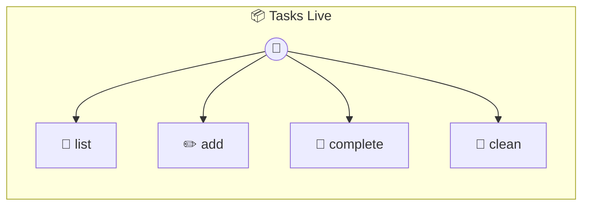

# Tasks Live

Live Task List — stateful, reactive, persistent Same functionality as tasks-basic, but tasks survive restarts and the UI updates in real-time via emit(). Uses `this.memory` for zero-boilerplate persistence — compare with tasks-basic to see the difference (no fs/path/os imports needed).

> **4 tools** · API Photon · v1.9.0 · MIT

**Platform Features:** `stateful`

## ⚙️ Configuration

No configuration required.


## 🔧 Tools


### `list`

List all tasks with visual status


---


### `add`

No description available


---


### `complete`

No description available


---


### `clean`

No description available


---


## 🏗️ Architecture




## 📥 Usage

```bash
# Install from marketplace
photon add tasks-live

# Get MCP config for your client
photon info tasks-live --mcp
```

## 📦 Dependencies

No external dependencies.

---

MIT · v1.9.0
