# Team Dashboard

Team Dashboard Photon A TV/monitor-optimized dashboard that aggregates data from multiple photons to give the whole team visibility into project progress. Perfect for office displays, war rooms, or remote team syncs.

> **20 tools** · API Photon · v1.0.0 · MIT

**Platform Features:** `custom-ui` `dashboard`

## ⚙️ Configuration

No configuration required.


## 📋 Quick Reference

| Method | Description |
|--------|-------------|
| `main` | Open the Team Dashboard. |
| `getDashboardData` | Get all dashboard data. |
| `getDebugPaths` | Debug: Show resolved paths |
| `getKanbanStats` | Get Kanban board statistics. |
| `getRecentCommits` | Get recent Git commits. |
| `checkServices` | Check service health. |
| `getGitHubStats` | Get GitHub issues and PRs from configured repos. |
| `getTodaysFocus` | Get today's focus task. |
| `getSummary` | Get a quick summary for AI. |
| `getConfig` | Get dashboard configuration |
| `updateConfig` | Update dashboard configuration |
| `addService` | Add a service to monitor |
| `removeService` | Remove a service from monitoring |
| `setGitRepo` | Set the Git repository path |
| `setTeamName` | Set team name displayed on dashboard |
| `addGitHubRepo` | Add a GitHub repository to track |
| `removeGitHubRepo` | Remove a GitHub repository from tracking |
| `listGitHubRepos` | List all tracked GitHub repositories |
| `listKanbanBoards` | List available Kanban boards. |
| `setKanbanBoard` | Set the Kanban board to display |


## 🔧 Tools


### `main`

Open the Team Dashboard. TV-optimized display showing project progress, recent activity, and service health. Auto-refreshes for always-on displays.


---


### `getDashboardData`

Get all dashboard data. Aggregates data from Kanban, Git, GitHub, and service monitors into a single dashboard-ready payload.


---


### `getDebugPaths`

Debug: Show resolved paths


---


### `getKanbanStats`

Get Kanban board statistics. Reads from the Kanban photon's data file to get task counts and progress.


---


### `getRecentCommits`

Get recent Git commits. Fetches the last 10 commits from the configured Git repository.


---


### `checkServices`

Check service health. Pings configured services to check if they're up or down.


---


### `getGitHubStats`

Get GitHub issues and PRs from configured repos. Fetches open issue and PR counts from all configured GitHub repositories. Uses the public GitHub API (no auth required for public repos).


---


### `getTodaysFocus`

Get today's focus task. Returns the highest priority in-progress task from the Kanban board.


---


### `getSummary`

Get a quick summary for AI. Returns a text summary of the dashboard state, perfect for AI to understand project status at a glance.


---


### `getConfig`

Get dashboard configuration


---


### `updateConfig`

Update dashboard configuration


---


### `addService`

Add a service to monitor


---


### `removeService`

Remove a service from monitoring


---


### `setGitRepo`

Set the Git repository path


---


### `setTeamName`

Set team name displayed on dashboard


---


### `addGitHubRepo`

Add a GitHub repository to track


| Parameter | Type | Required | Description |
|-----------|------|----------|-------------|
| `repo` | string | Yes | - Repository in "owner/repo" format (e.g., "facebook/react") |


---


### `removeGitHubRepo`

Remove a GitHub repository from tracking


| Parameter | Type | Required | Description |
|-----------|------|----------|-------------|
| `repo` | string | Yes | - Repository in "owner/repo" format |


---


### `listGitHubRepos`

List all tracked GitHub repositories


---


### `listKanbanBoards`

List available Kanban boards. Scans the kanban/boards directory for available board files.


---


### `setKanbanBoard`

Set the Kanban board to display


| Parameter | Type | Required | Description |
|-----------|------|----------|-------------|
| `board` | string | Yes | - Board name (without .json extension) |


---


## 🏗️ Architecture

```mermaid
flowchart LR
    subgraph team_dashboard["📦 Team Dashboard"]
        direction TB
        PHOTON((🎯))
        T0[🔧 main]
        PHOTON --> T0
        T1[📖 getDashboardData]
        PHOTON --> T1
        T2[📖 getDebugPaths]
        PHOTON --> T2
        T3[📖 getKanbanStats]
        PHOTON --> T3
        T4[📖 getRecentCommits]
        PHOTON --> T4
        T5[✅ checkServices]
        PHOTON --> T5
        T6[📖 getGitHubStats]
        PHOTON --> T6
        T7[📖 getTodaysFocus]
        PHOTON --> T7
        T8[📖 getSummary]
        PHOTON --> T8
        T9[📖 getConfig]
        PHOTON --> T9
        T10[🔄 updateConfig]
        PHOTON --> T10
        T11[✏️ addService]
        PHOTON --> T11
        T12[🗑️ removeService]
        PHOTON --> T12
        T13[✏️ setGitRepo]
        PHOTON --> T13
        T14[✏️ setTeamName]
        PHOTON --> T14
        T15[✏️ addGitHubRepo]
        PHOTON --> T15
        T16[🗑️ removeGitHubRepo]
        PHOTON --> T16
        T17[📖 listGitHubRepos]
        PHOTON --> T17
        T18[📖 listKanbanBoards]
        PHOTON --> T18
        T19[✏️ setKanbanBoard]
        PHOTON --> T19
    end
```




## 📥 Usage

```bash
# Install from marketplace
photon add team-dashboard

# Get MCP config for your client
photon info team-dashboard --mcp
```

## 📦 Dependencies

No external dependencies.

---

MIT · v1.0.0 · Portel
