# Team Pulse

Team Pulse — Async Standup with Memory + Channels + Locking Post daily updates, see what the team posted, search past standups. Updates persist via `this.memory`, broadcast to all sessions via channels, and use distributed locking to prevent duplicate rapid-fire posts.

> **4 tools** · API Photon · v1.8.4 · MIT

**Platform Features:** `channels`

## ⚙️ Configuration

No configuration required.


## 🔧 Tools


### `post`

Post a standup update  Persists to memory, broadcasts to all open sessions, and uses a distributed lock to prevent duplicate rapid-fire submissions.


| Parameter | Type | Required | Description |
|-----------|------|----------|-------------|
| `name` | string | Yes | Your name |
| `update` | string | Yes | What you worked on / plan to work on |
| `blockers` | string | No | Any blockers |


---


### `today`

See today's standup updates


---


### `history`

Past standup history grouped by date


| Parameter | Type | Required | Description |
|-----------|------|----------|-------------|
| `days` | any | Yes | Number of days to look back {@default 7} [min: 1, max: 90] |


---


### `search`

Search past updates by keyword


| Parameter | Type | Required | Description |
|-----------|------|----------|-------------|
| `query` | string | Yes | Search term |


---


## 🏗️ Architecture

```mermaid
flowchart LR
    subgraph team_pulse["📦 Team Pulse"]
        direction TB
        PHOTON((🎯))
        T0[📤 post]
        PHOTON --> T0
        T1[🔧 today]
        PHOTON --> T1
        T2[🔧 history]
        PHOTON --> T2
        T3[📖 search]
        PHOTON --> T3
    end
```




## 📥 Usage

```bash
# Install from marketplace
photon add team-pulse

# Get MCP config for your client
photon info team-pulse --mcp
```

## 📦 Dependencies

No external dependencies.

---

MIT · v1.8.4
