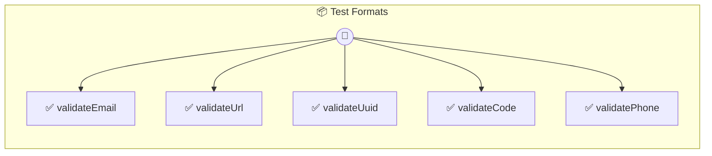

# Test Formats

Test format-based input validation

> **5 tools** · API Photon · v1.17.6 · MIT


## ⚙️ Configuration

No configuration required.


## 🔧 Tools


### `validateEmail`

Validate email address


| Parameter | Type | Required | Description |
|-----------|------|----------|-------------|
| `email` | string | Yes | User email address [format: email] |


---


### `validateUrl`

Validate website URL


| Parameter | Type | Required | Description |
|-----------|------|----------|-------------|
| `url` | string | Yes | Website URL [format: url] |


---


### `validateUuid`

Validate UUID identifier


| Parameter | Type | Required | Description |
|-----------|------|----------|-------------|
| `id` | string | Yes | Unique identifier [format: uuid] |


---


### `validateCode`

Validate product code


| Parameter | Type | Required | Description |
|-----------|------|----------|-------------|
| `code` | string | Yes | Product code format XXX123 \d{3}$} [pattern: ^[A-Z]{3] |


---


### `validatePhone`

Validate phone number


| Parameter | Type | Required | Description |
|-----------|------|----------|-------------|
| `phone` | string | Yes | Phone number with country code [format: phone] |


---


## 🏗️ Architecture




## 📥 Usage

```bash
# Install from marketplace
photon add test-formats

# Get MCP config for your client
photon info test-formats --mcp
```

## 📦 Dependencies

No external dependencies.

---

MIT · v1.17.6
