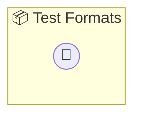

# Test Formats

Test format-based input validation

> **0 tools** · API Photon · v1.11.0 · MIT


## ⚙️ Configuration

No configuration required.


## 🔧 Tools


No tools defined.


## 🏗️ Architecture




## 📥 Usage

```bash
# Install from marketplace
photon add test-formats

# Get MCP config for your client
photon info test-formats --mcp
```

## 📦 Dependencies

No external dependencies.

---

MIT · v1.11.0
