# Time

Timezone and time conversion operations

> **3 tools** · API Photon · v1.0.0 · MIT


## ⚙️ Configuration


| Variable | Required | Type | Description |
|----------|----------|------|-------------|
| `TIME_LOCAL_TIMEZONE` | No | string | Override system timezone (optional, IANA timezone name) |


### Setup Instructions

- local_timezone: Override system timezone (optional, IANA timezone name)


## 🔧 Tools


### `now`

Current time in a specific timezone


| Parameter | Type | Required | Description |
|-----------|------|----------|-------------|
| `timezone` | any | Yes | IANA timezone name (e.g. `America/New_York`) |


---


### `convert`

Convert time from one timezone to another


| Parameter | Type | Required | Description |
|-----------|------|----------|-------------|
| `source_timezone` | string | Yes | Source IANA timezone [min: 1, max: 100] (e.g. `America/New_York`) |
| `time` | string | Yes | Time in 24-hour format (HH:MM) [min: 1, max: 10, format: time] (e.g. `14:30`) |
| `target_timezone` | string | Yes | Target IANA timezone [min: 1, max: 100] (e.g. `Europe/London`) |
| `date` | string | No | Date in YYYY-MM-DD format (optional, default: today) [max: 20, format: date] (e.g. `2024-03-15`) |


---


### `timezones`

List common IANA timezones by region


| Parameter | Type | Required | Description |
|-----------|------|----------|-------------|
| `region` | any | Yes | Filter by region (e.g. `America`) |


---


## 🏗️ Architecture

```mermaid
flowchart LR
    subgraph time["📦 Time"]
        direction TB
        PHOTON((🎯))
        T0[🔧 now]
        PHOTON --> T0
        T1[🔧 convert]
        PHOTON --> T1
        T2[🔧 timezones]
        PHOTON --> T2
    end
```




## 📥 Usage

```bash
# Install from marketplace
photon add time

# Get MCP config for your client
photon info time --mcp
```

## 📦 Dependencies

No external dependencies.

---

MIT · v1.0.0 · Portel
