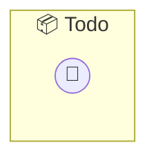

# Todo List

Reactive collections in action Demonstrates Photon's reactive arrays: just use normal array methods (push, splice, filter) and the runtime automatically emits events so connected UIs update in real-time.

> **0 tools** · API Photon · v1.0.0 · MIT


## ⚙️ Configuration

No configuration required.


## 🔧 Tools


No tools defined.


## 🏗️ Architecture




## 📥 Usage

```bash
# Install from marketplace
photon add todo

# Get MCP config for your client
photon info todo --mcp
```

## 📦 Dependencies

No external dependencies.

---

MIT · v1.0.0 · Portel
