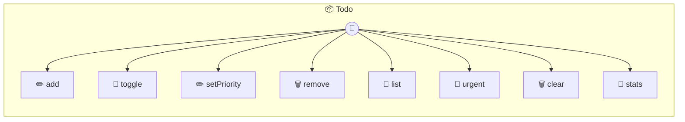

# Todo List

Reactive collections in action A beautifully simple task manager showing Photon's reactive arrays. Just manipulate `items` like a normal array (push, splice, map) and the runtime automatically persists to disk and emits events so connected UIs update in real-time. No async boilerplate needed. Use `@priority` to filter by importance, `@done` to filter by status.

> **8 tools** · API Photon · v1.1.0 · MIT

**Platform Features:** `stateful`

## ⚙️ Configuration

No configuration required.


## 📋 Quick Reference

| Method | Description |
|--------|-------------|
| `add` | Add a new task |
| `toggle` | Mark a task as done/incomplete |
| `setPriority` | Update task priority |
| `remove` | Remove a task |
| `list` | List all tasks, optionally filtered by status or priority |
| `urgent` | Get high-priority pending tasks |
| `clear` | Clear all completed tasks |
| `stats` | Get statistics |


## 🔧 Tools


### `add`

Add a new task


| Parameter | Type | Required | Description |
|-----------|------|----------|-------------|
| `title` | string | Yes | - (e.g. `Buy groceries`) |
| `priority` | 'low' | 'medium' | 'high' | No | {@default medium} [choice: low,medium,high] |


---


### `toggle`

Mark a task as done/incomplete


| Parameter | Type | Required | Description |
|-----------|------|----------|-------------|
| `id` | string | Yes | Task ID |


---


### `setPriority`

Update task priority


| Parameter | Type | Required | Description |
|-----------|------|----------|-------------|
| `id` | string | Yes | Task ID |
| `priority` | 'low' | 'medium' | 'high' | Yes | - [choice: low,medium,high] |


---


### `remove`

Remove a task


| Parameter | Type | Required | Description |
|-----------|------|----------|-------------|
| `id` | string | Yes | Task ID |


---


### `list`

List all tasks, optionally filtered by status or priority


| Parameter | Type | Required | Description |
|-----------|------|----------|-------------|
| `priority` | any | Yes | - [choice: low,medium,high] |
| `done` | boolean } | No | - [choice: true,false] |


---


### `urgent`

Get high-priority pending tasks


---


### `clear`

Clear all completed tasks


---


### `stats`

Get statistics


---


## 🏗️ Architecture


```mermaid
flowchart LR
    subgraph todo["📦 Todo"]
        direction TB
        PHOTON((🎯))
        T0[✏️ add]
        PHOTON --> T0
        T1[🔧 toggle]
        PHOTON --> T1
        T2[✏️ setPriority]
        PHOTON --> T2
        T3[🗑️ remove]
        PHOTON --> T3
        T4[📖 list]
        PHOTON --> T4
        T5[🔧 urgent]
        PHOTON --> T5
        T6[🗑️ clear]
        PHOTON --> T6
        T7[🔧 stats]
        PHOTON --> T7
    end
```


## 📥 Usage

```bash
# Install from marketplace
photon add todo

# Get MCP config for your client
photon info todo --mcp
```

## 📦 Dependencies

No external dependencies.

---

MIT · v1.1.0 · Portel
