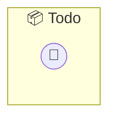

# Todo List

Reactive collections in action A beautifully simple task manager showing Photon's reactive arrays. Just manipulate `items` like a normal array (push, splice, map) and the runtime automatically persists to disk and emits events so connected UIs update in real-time. No async boilerplate needed. Use `@priority` to filter by importance, `@done` to filter by status.

> **0 tools** · API Photon · v1.1.0 · MIT

**Platform Features:** `stateful`

## ⚙️ Configuration

No configuration required.


## 🔧 Tools


No tools defined.


## 🏗️ Architecture


```mermaid
flowchart LR
    subgraph todo["📦 Todo"]
        direction TB
        PHOTON((🎯))
    end
```


## 📥 Usage

```bash
# Install from marketplace
photon add todo

# Get MCP config for your client
photon info todo --mcp
```

## 📦 Dependencies

No external dependencies.

---

MIT · v1.1.0 · Portel
