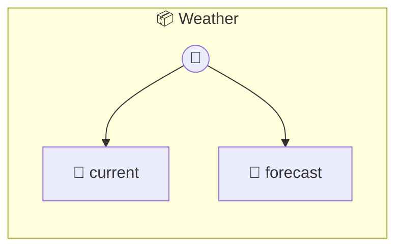

# Weather

Wrap any API in 20 lines Shows how a photon turns an external API into MCP tools with zero boilerplate. Uses the free Open-Meteo API (no API key needed).

> **2 tools** · API Photon · v1.0.0 · MIT


## ⚙️ Configuration

No configuration required.


## 🔧 Tools


### `current`

Get current weather for a location


| Parameter | Type | Required | Description |
|-----------|------|----------|-------------|
| `latitude` | number | Yes | Latitude (-90 to 90) |
| `longitude` | number | Yes | Longitude (-180 to 180) |


---


### `forecast`

Get 7-day forecast for a location


| Parameter | Type | Required | Description |
|-----------|------|----------|-------------|
| `latitude` | number | Yes | Latitude (-90 to 90) |
| `longitude` | number | Yes | Longitude (-180 to 180) |


---


## 🏗️ Architecture




## 📥 Usage

```bash
# Install from marketplace
photon add weather

# Get MCP config for your client
photon info weather --mcp
```

## 📦 Dependencies

No external dependencies.

---

MIT · v1.0.0 · Portel
