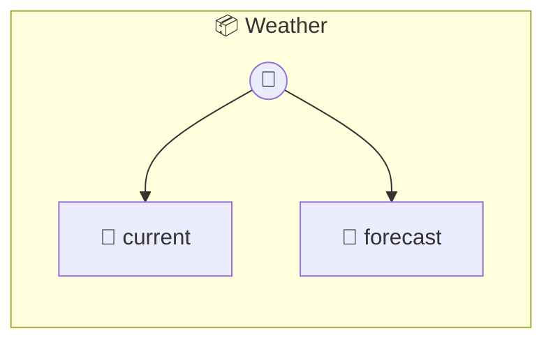

# Weather

Current weather and forecasts

> **2 tools** · API Photon · v1.0.0 · MIT


## ⚙️ Configuration

No configuration required.


## 🔧 Tools


### `current`

Current weather conditions


| Parameter | Type | Required | Description |
|-----------|------|----------|-------------|
| `latitude` | number | Yes | - (e.g. `40.7128`) |
| `longitude` | number | Yes | - (e.g. `-74.006`) |


---


### `forecast`

7-day weather forecast


| Parameter | Type | Required | Description |
|-----------|------|----------|-------------|
| `latitude` | number | Yes | - (e.g. `40.7128`) |
| `longitude` | number | Yes | - (e.g. `-74.006`) |


---


## 🏗️ Architecture




## 📥 Usage

```bash
# Install from marketplace
photon add weather

# Get MCP config for your client
photon info weather --mcp
```

## 📦 Dependencies

No external dependencies.

---

MIT · v1.0.0 · Portel
