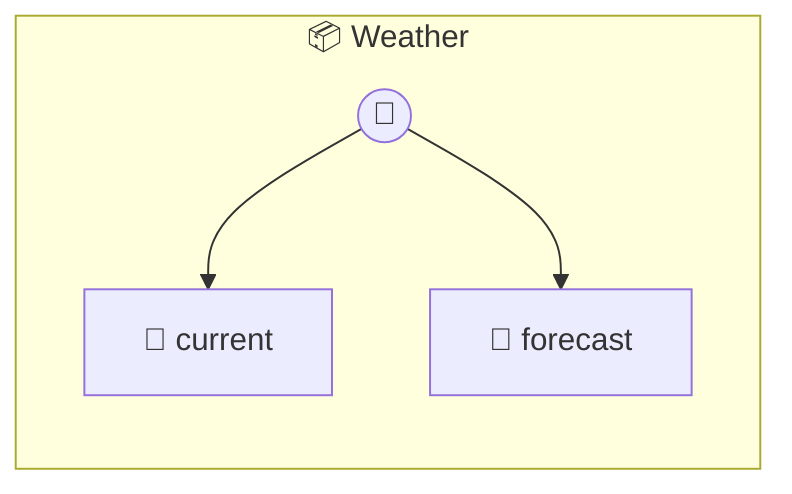

# Weather

Current weather and forecasts

Zero-dependency weather API wrapper using Open-Meteo (free, no key required).

> **2 tools** · API Photon · v1.1.0 · MIT


## ⚙️ Configuration

No configuration required.


## 🔧 Tools


### `current`

Current weather conditions


| Parameter | Type | Required | Description |
|-----------|------|----------|-------------|
| `latitude` | number | Yes | Latitude in decimal degrees (e.g. `1.3521`) |
| `longitude` | number | Yes | Longitude in decimal degrees (e.g. `103.8198`) |


---


### `forecast`

7-day weather forecast


| Parameter | Type | Required | Description |
|-----------|------|----------|-------------|
| `latitude` | number | Yes | Latitude in decimal degrees (e.g. `1.3521`) |
| `longitude` | number | Yes | Longitude in decimal degrees (e.g. `103.8198`) |


---


## 🏗️ Architecture


```mermaid
flowchart LR
    subgraph weather["📦 Weather"]
        direction TB
        PHOTON((🎯))
        T0[🔧 current]
        PHOTON --> T0
        T1[🔧 forecast]
        PHOTON --> T1
    end
```


## 📥 Usage

```bash
# Install from marketplace
photon add weather

# Get MCP config for your client
photon info weather --mcp
```

## 📦 Dependencies

No external dependencies.

---

MIT · v1.1.0 · Portel
