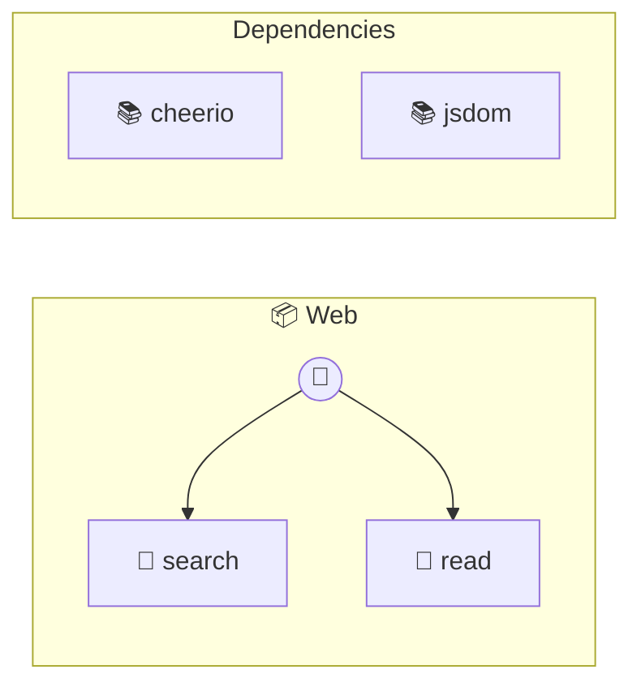

# Web

Search and read webpages

> **2 tools** · API Photon · v2.0.0 · MIT


## ⚙️ Configuration

No configuration required.


## 🔧 Tools


### `search`

Search the web


| Parameter | Type | Required | Description |
|-----------|------|----------|-------------|
| `query` | string | Yes | Search query |
| `limit` | number | No | Number of results {@default 10} [min: 1, max: 50] |


---


### `read`

Read webpage content


| Parameter | Type | Required | Description |
|-----------|------|----------|-------------|
| `url` | string | Yes | URL to read (e.g. `https://example.com`) |


---


## 🏗️ Architecture




## 📥 Usage

```bash
# Install from marketplace
photon add web

# Get MCP config for your client
photon info web --mcp
```

## 📦 Dependencies


```
cheerio@^1.0.0, @mozilla/readability@^0.5.0, jsdom@^23.0.0
```

---

MIT · v2.0.0 · Portel
